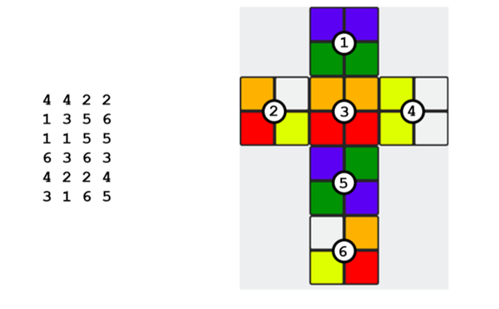
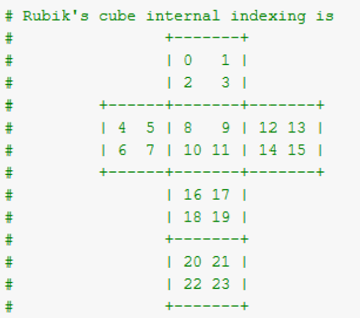
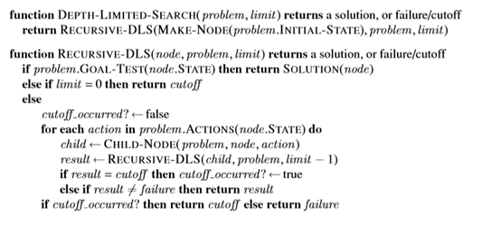
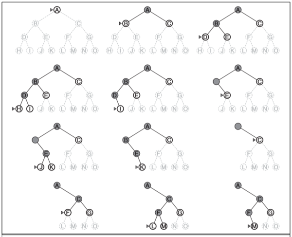

# Solving-2x2-Rubik-Cube-by-using-Depth-Limited-Search-Algorithm-DLS-Algorithm-
In this project, we designed a 2x2 Rubik cube that is playable and the user can give his colors so the program will test if the Rubik is solvable 
(this program is not optimized i didn't have enough time to do it ) 

# Rubik Class : 
This Class has these function 
* **Swap** :
This function gets 4 cells and the direcetion of rotation and it will changes the rubik based on those
* **Rotate** : 
This function gets number of rubik face and the direcetion of rotation anb will change the Rubik 
* **show** : 
It will show the Rubik like below image

* **goal_test**: 
This will check if the Rubik is solved or not and returns a true of flase 
#matrix Class: 
This class I have explained it in another repository before you can find it here
* **graph class ** : 
It will get the number of depth and solve the Rubik based on the below algorithm

